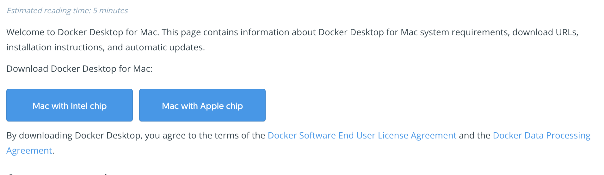
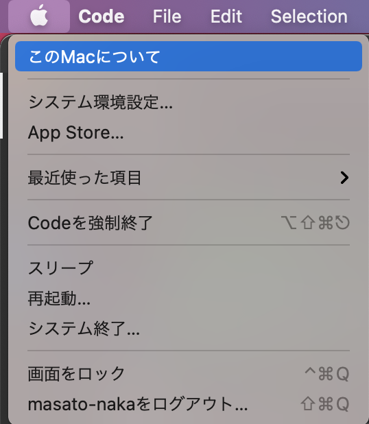
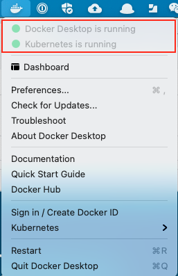
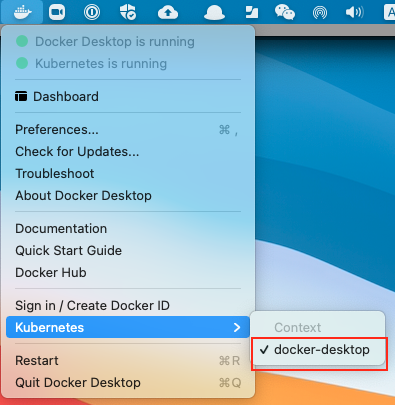

# Environment Setup

## Docker Desktop

### Install

1. Open docker desktop installation page: https://docs.docker.com/docker-for-mac/install/
1. Download Docker Desktop for Mac (choose one that matches your Mac):
    

    If you don't know which one to choose. Please check your mac from the mac icon.
    

About Mac

    

    

    

1. Install it following https://docs.docker.com/docker-for-mac/install/#install-and-run-docker-desktop-on-mac
    1. Double-click `Docker.dmg` to open the installer, then drag the Docker icon to the Applications folder.
    1. Double-click Docker.app in the Applications folder to start Docker.
1. Check if Docker is running.

### Kubernetes in Docker Desktop

1. Check Docker status.
    
1. Enable Kubernetes (https://docs.docker.com/desktop/kubernetes/#enable-kubernetes)
1. Check kube context.
    

## Visual Studio Code

Download from https://code.visualstudio.com/download and install.
