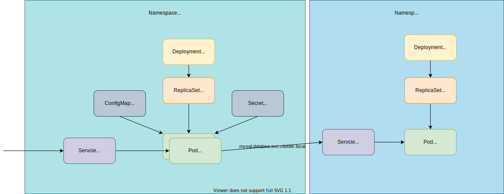

# Deploy Simple Application in Kubernetes

## Diagram
### Application


### Kubernetes Objects



## Create MySQL (Deployment and Service) in database namespace

Notice: `StatefulSet` is more preferable resource to manage database applications, but just for simplicity `Deployment` is used for MySQL here.

1. Create `database` namespace.
    ```
    kubectl create namespace database
    ```

    - [ ] Check your namespace exists

        ```
        kubectl get ns database
        NAME       STATUS   AGE
        database   Active   9s
        ```

1. Create Deployment for MySQL.

    ```
    kubectl apply -f mysql-deployment.yaml -n database
    ```

    <details><summary>how to create the yaml easily</summary>

    Create base yaml file:

    ```
    kubectl create deploy mysql --image=mysql:5.7 --dry-run=client -o yaml > mysql-deployment.yaml
    ```

    Add required `env`:

    ```yaml
        env:
          - name: MYSQL_ROOT_PASSWORD
            value: password
          - name: MYSQL_DATABASE
            value: test_db
          - name: MYSQL_USER
            value: sample_app
          - name: MYSQL_PASSWORD
            value: password
    ```

    </details>

    - [ ] Check `Deployment` in database `Namespace`

        ```
        kubectl get deploy -n database
        ```

    - [ ] Check `ReplicaSet` in database `Namespace`

        ```
        kubectl describe replicaset -n database
        ```

        <details><summary>result</summary>

            ...
            Controlled By:  Deployment/mysql
            ...

        </details>

    - [ ] Check `Pod` in database `Namespace`

        ```
        kubectl get pods -n database
        ```

    - [ ] Check if you can connect to MySQL with `kubectl exec`

        ```
        kubectl exec -n database -it $(kubectl get po -n database | grep mysql | head -1 | awk '{print $1}') -- mysql -uroot -ppassword
        ```

        <details><summary>result</summary>

        ```sql
        mysql: [Warning] Using a password on the command line interface can be insecure.
        Welcome to the MySQL monitor.  Commands end with ; or \g.
        Your MySQL connection id is 3
        Server version: 5.7.35 MySQL Community Server (GPL)

        Copyright (c) 2000, 2021, Oracle and/or its affiliates.

        Oracle is a registered trademark of Oracle Corporation and/or its
        affiliates. Other names may be trademarks of their respective
        owners.

        Type 'help;' or '\h' for help. Type '\c' to clear the current input statement.

        mysql>
        ```

        </details>

1. Create Service for MySQL.

    1. Create `Service`.

        ```
        kubectl create -f mysql-service.yaml -n database
        ```

        <details><summary>how to create the yaml easily</summary>

        ```
        kubectl create service clusterip mysql --tcp=3306 --dry-run=client --output yaml > mysql-service.yaml
        ```

        </details>

        - [ ] Check the created `Service`

            ```
            kubectl get service -n database
            ```

## Create sample application (Deployment, ConfigMap, Secret, and Service) in your namespace

Sample application: https://github.com/nakamasato/fastapi-sample

1. Set your name to `namespace` variable.

    ```
    namespace=<yourname>
    ```
1. Create your namespace.
    ```
    kubectl create namespace $namespace
    ```

    - [ ] Check your namespace exists

        ```
        kubectl get ns $namespace
        NAME   STATUS   AGE
        naka   Active   71m
        ```

1. Create `Deployment` yaml.

    - [ ] Create Deployemnt yaml with container image to `ghcr.io/nakamasato/fastapi-sample:v1.0`.
        ```
        kubectl create deploy sample-app --image=ghcr.io/nakamasato/fastapi-sample:v1.0 --dry-run=client -o yaml > sample-app-deployment.yaml
        ```
    - [ ] Set environment variables from `ConfigMap`.
        ```yaml
        envFrom:
          - configMapRef:
              name: sample-app
        ```
    - [ ] Set environment variable from `Secret`.
        ```yaml
        envFrom:
          ..
          - secretRef:
              name: sample-app
        ```

1. Create `ConfigMap` yaml.

    1. Prepare `env.txt`.

        ```
        MYSQL_HOST=mysql.database.svc.cluster.local
        MYSQL_DATABASE=test_db
        MYSQL_USER=sample_app
        ```
    1. Create yaml from `env.txt`.
        ```
        kubectl create cm sample-app --from-env-file=env.txt --dry-run=client -o yaml > sample-app-configmap.yaml
        ```

1. Create `Secret` yaml.

    ```
    kubectl create secret generic sample-app --from-literal=MYSQL_PASSWORD=password --dry-run=client -o yaml > sample-app-secret.yaml
    ```

1. Apply `Deployment`, `ConfigMap`, and `Secret`.

    ```
    kubectl apply -f sample-app-deployment.yaml,sample-app-configmap.yaml,sample-app-secret.yaml -n $namespace
    ```

    - [ ] Check `Deployment` in your namespace

        ```
        kubectl get deploy -n $namespace
        ```

    - [ ] Check `Pod` in your namespace

        ```
        kubectl get pods -n $namespace
        ```

    - [ ] Check `ConfigMap` in your namespace

        ```
        kubectl get cm -n $namespace
        ```

    - [ ] Check `Secret` in your namespace

        ```
        kubectl get secret -n $namespace
        ```

1. Apply `Service`.

    ```
    kubectl apply -f sample-app-service.yaml -n $namespace
    ```

    <details><summary>How to create the yaml easily</summary>

        kubectl create service clusterip sample-app --tcp=80 --dry-run=client -o yaml > sample-app-service.yaml

    </details>

    - [ ] Check the created `Service`

        ```
        kubectl get service -n $namespace
        ```

    - [ ] Check accessibility with `kubectl port-forward`


        ```
        kubectl port-forward svc/sample-app 8080:80 -n $namespace
        ```

        ```
        curl http://localhost:8080/
        {"message":"Hello World"}
        ```

        http://localhost:8080/docs

        <details><summary>result</summary>

        

        </details>

## Clean up resources

```
kubectl delete -f sample-app-deployment.yaml,sample-app-configmap.yaml,sample-app-secret.yaml,sample-app-service.yaml -n $namespace
kubectl delete -f mysql-deployment.yaml,mysql-service.yaml -n database
kubectl delete ns $namespace
kubectl delete ns database
```
