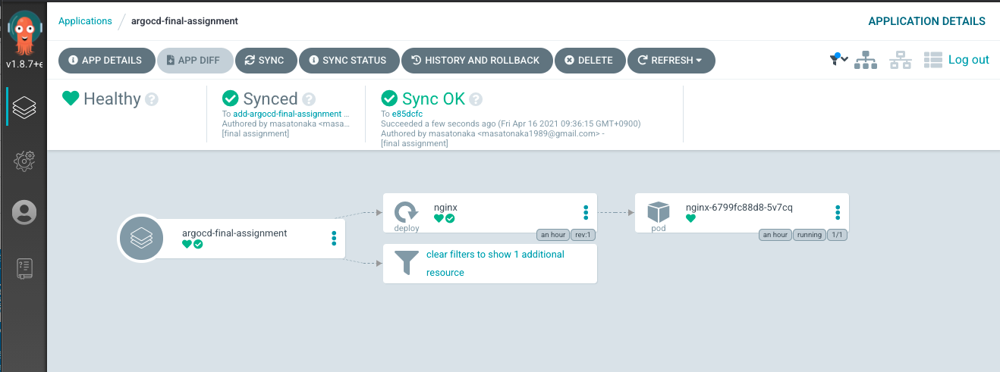
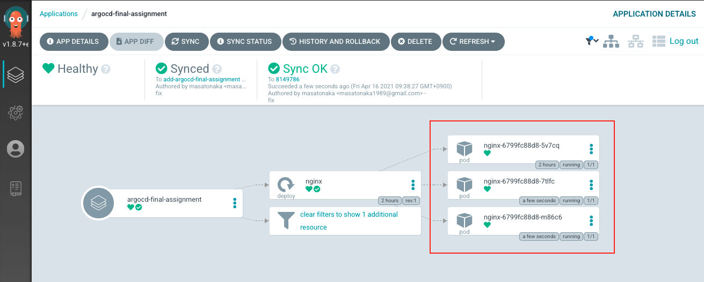
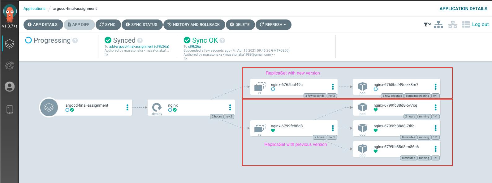
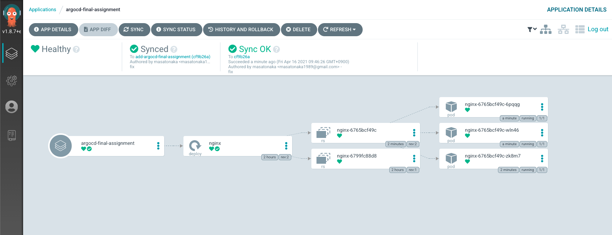
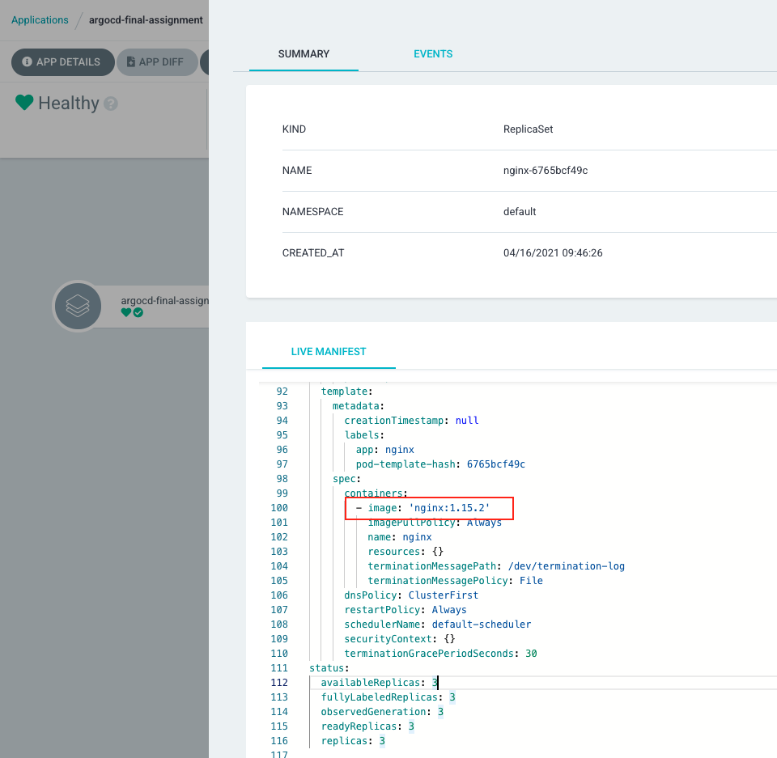

# ArgoCD assignment

## Prerequisite

- ArgoCD is already installed.

If not, you can install with the following commands:

```
kubectl create namespace argocd
kubectl apply -n argocd -f https://raw.githubusercontent.com/argoproj/argo-cd/v2.1.1/manifests/install.yaml
kubectl expose deployment argocd-server --type=NodePort --name=argocd-server-node-port --target-port=8080 --port=30080 -n argocd
```

## Step

1. Create your own Git repository.
1. Create `argocd-test/nginx-deployment.yaml`. (You can copy the file from this repo.)
1. Add `argocd-test/nginx-deployment.yaml`, commit, and push to your repository.
1. Create ArgoCD Application yaml file. (name: argocd-final-assignment, project: default, namespace: default, source: <your git repository>, revision: master, path: argocd-test) [argocd-final-assignment.yaml]()
1. Apply ArgoCD Application by `kubectl apply -f argocd-final-assignment.yaml`
1. Check application is running on ArgoCD UI.

    

1. Change `argocd-test/nginx-deployment.yaml` to `replicas: 3`
1. Check argocd-final-assignment has 3 pods on ArgoCD UI.

    

1. Change image with `nginx:1.15.2` in `argocd-test/nginx-deployment.yaml` and push.
1. Check argocd-final-assignment and image is updated.
    - During rolling update:

        

    - After updating:

        

    - Check the image in the new replicaset:

        
