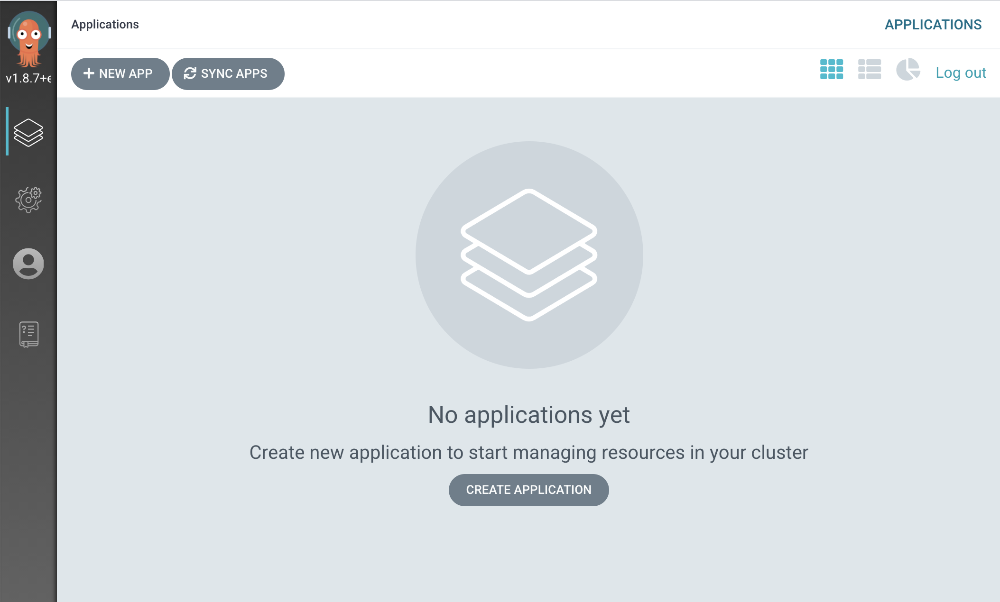
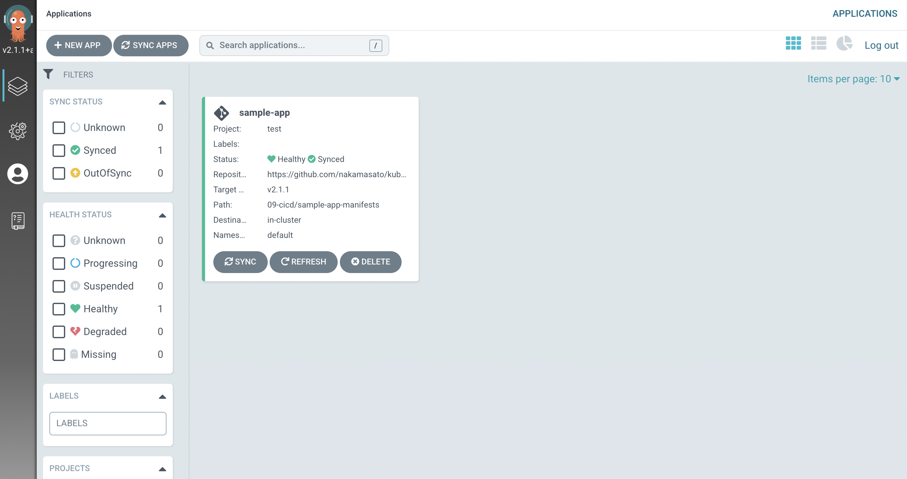
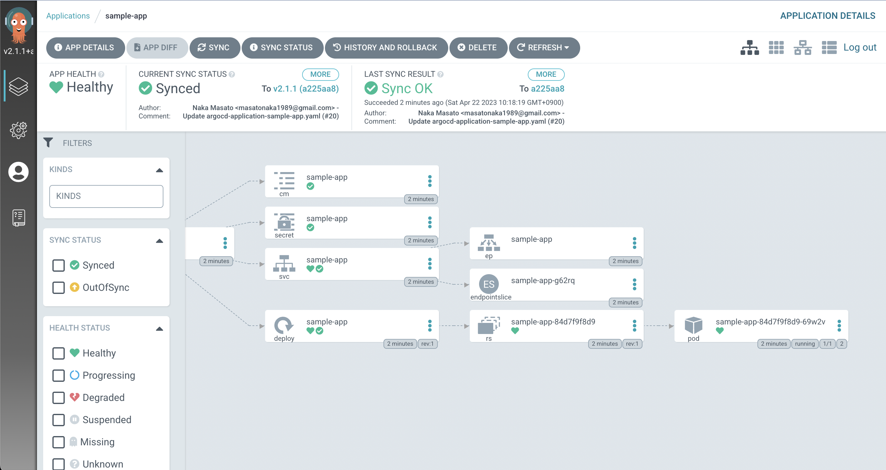
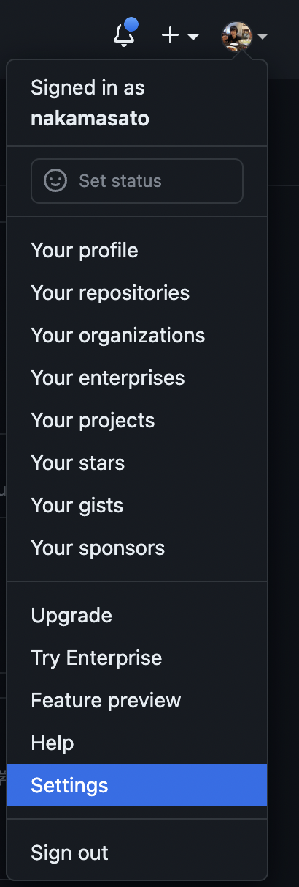
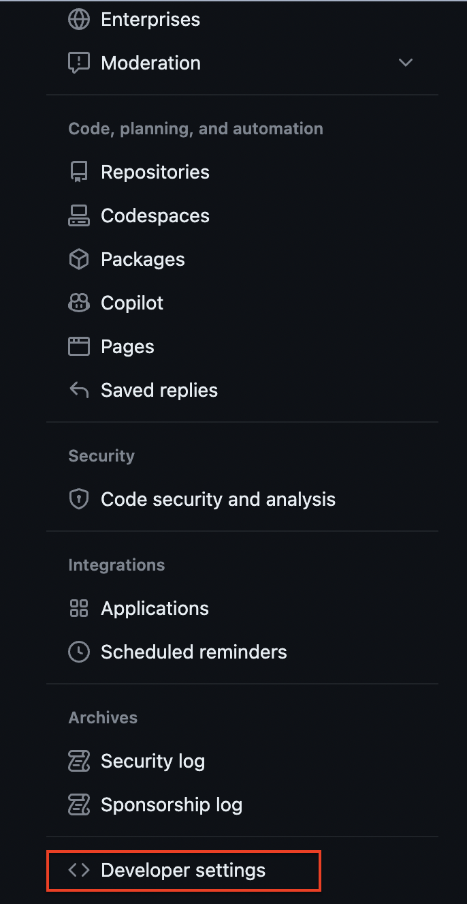
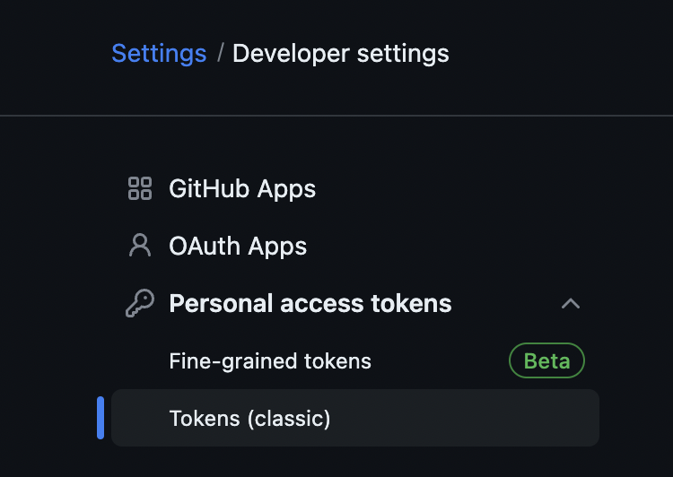
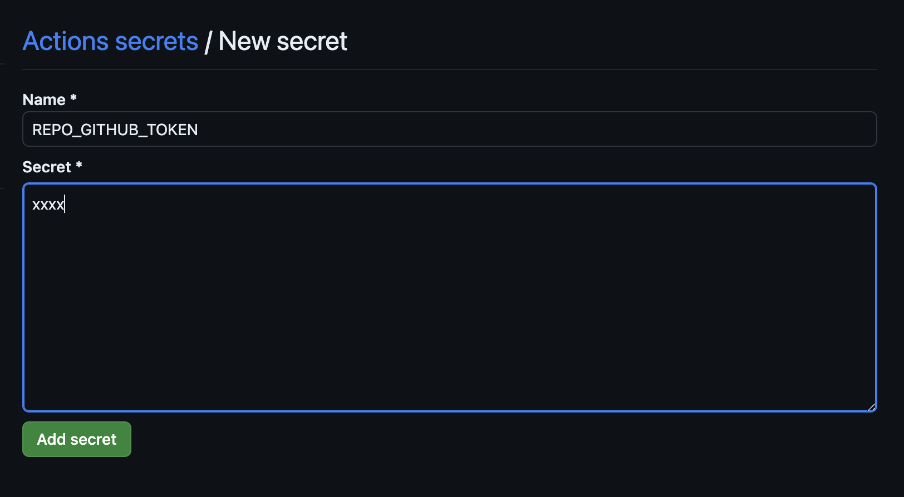

# CI/CD

## 1. GitHub Actions

### 1.1. GitHub Actions: Build and push image

1. `.github/workflows/deploy-pr.yaml` in application repository e.g. https://github.com/nakamasato/fastapi-sample/pull/97
1. `name`: Job name e.g. `deploy-pr`
1. `on`: trigger of the workflow
    1. Specify `pull_request` with `paths`
1. `jobs`: define one or more jobs
    1. Create a new job with id `build-and-push-image`
    1. `runs-on`: define machine type for the job. e.g. `ubuntu-latest`
    1. `steps`: series of steps in the job
        1. `name`: (optional) step name. you can give any arbitrary name. e.g. `Checkout repository`
        1. `uses`: specify which actions to use. e.g. `actions/checkout@v4`, `docker/build-push-action@v5`, ...
        1. `with`: Actions' configuration. The input value is different from each GitHub Actions.

```yaml
name: deploy-pr

on:
  pull_request:
    paths:
      - 'app/**'
      - .github/workflows/deploy-pr.yml

env:
  REGISTRY: ghcr.io

jobs:
  build-and-push-image:
    runs-on: ubuntu-latest
    steps:
      - name: Checkout repository
        uses: actions/checkout@v4

      - name: Docker meta
        id: meta
        uses: docker/metadata-action@v5
        with:
          images: ${{ env.REGISTRY }}/${{ github.repository }} # ghcr.io/nakamasato/fastapi-sample

      - name: Log in to GitHub container registry
        uses: docker/login-action@v3
        with:
          registry: ${{ env.REGISTRY }}
          username: ${{ github.actor }}
          password: ${{ secrets.GITHUB_TOKEN }}

      - name: Build and push
        uses: docker/build-push-action@v5
        with:
          context: app
          push: true
          tags: ${{ steps.meta.outputs.tags }}
          labels: ${{ steps.meta.outputs.labels }}
```

### 1.2. GitHub Actions: Create a Pull Request to update a manifest

1. Add a new job `update-manifest-file`.
1. In the new job, we need to reference the new docker image name built in the above job `build-and-push-image`.
    1. `outputs`: key-value map that can be referenced by subsequent jobs.
        1. Set `outputs` in the job `build-and-push-image`
            ```yaml
            outputs:
              IMAGE_FULL_NAME: ${{ steps.meta.outputs.tags }}
            ```
    1. `needs`: specify a list of the ids of dependent jobs.
        ```yaml
        needs: [build-and-push-image]
        ```
    1. Add a step to update manifest file.
        ```yaml
        - name: Update fastapi-sample image
          env:
            IMAGE_FULL_NAME: ${{ needs.build-and-push-image.outputs.IMAGE_FULL_NAME }}
          run: |
            yq -i "(.spec.template.spec.containers[] | select(.name == \"fastapi-sample\")).image = \"$IMAGE_FULL_NAME\"" manifests/fastapi-sample/deployment.yaml
        ```
    1. Add a step to create a pr with `peter-evans/create-pull-request@v5`
        ```yaml
        - name: Create PR
          uses: peter-evans/create-pull-request@v5
          with:
            base: main
            title: "Update fastapi-sample"
            draft: true
            body: |
              # Changes
              - Update `fastapi-sample` image to ${{ needs.build-and-push-image.outputs.IMAGE_FULL_NAME }}
        ```

<details><summary>Full yaml</summary>

```yaml
name: deploy-pr

on:
  pull_request:
    paths:
      - 'app/**'
      - .github/workflows/deploy-pr.yml

env:
  REGISTRY: ghcr.io

jobs:
  build-and-push-image:
    outputs:
      IMAGE_FULL_NAME: ${{ steps.meta.outputs.tags }}
    runs-on: ubuntu-latest
    steps:
      - name: Checkout repository
        uses: actions/checkout@v4

      - name: Docker meta
        id: meta
        uses: docker/metadata-action@v5
        with:
          images: ${{ env.REGISTRY }}/${{ github.repository }} # ghcr.io/nakamasato/fastapi-sample

      - name: Log in to GitHub container registry
        uses: docker/login-action@v3
        with:
          registry: ${{ env.REGISTRY }}
          username: ${{ github.actor }}
          password: ${{ secrets.GITHUB_TOKEN }}

      - name: Build and push
        uses: docker/build-push-action@v5
        with:
          context: app
          push: true
          tags: ${{ steps.meta.outputs.tags }}
          labels: ${{ steps.meta.outputs.labels }}

  update-kubernetes-manifest:
    runs-on: ubuntu-latest
    needs: [build-and-push-image]
    steps:
      - name: Checkout repository
        uses: actions/checkout@v4

      - name: Update fastapi-sample image
        env:
          IMAGE_FULL_NAME: ${{ needs.build-and-push-image.outputs.IMAGE_FULL_NAME }}
        run: |
          yq -i "(.spec.template.spec.containers[] | select(.name == \"fastapi-sample\")).image = \"$IMAGE_FULL_NAME\"" manifests/fastapi-sample/deployment.yaml
      - name: Create PR
        uses: peter-evans/create-pull-request@v5
        with:
          base: main
          title: "Update fastapi-sample"
          draft: true
          body: |
            # Changes
            - Update `fastapi-sample` image to ${{ needs.build-and-push-image.outputs.IMAGE_FULL_NAME }}
```

</details>

## 2. [ArgoCD](https://argo-cd.readthedocs.io/en/stable/)

### 2.1. Setup ArgoCD

1. Install ArgoCD (Version [v2.8.4](https://github.com/argoproj/argo-cd/releases/tag/v2.8.4))

    ```
    kubectl create namespace argocd
    kubectl apply -n argocd -f https://raw.githubusercontent.com/argoproj/argo-cd/v2.8.4/manifests/install.yaml
    ```

1. Check
    ```
    kubectl get pod -n argocd
    NAME                                                READY   STATUS    RESTARTS   AGE
    argocd-application-controller-0                     1/1     Running   0          48s
    argocd-applicationset-controller-787bfd9669-xh6hh   1/1     Running   0          48s
    argocd-dex-server-bb76f899c-c92zj                   1/1     Running   0          48s
    argocd-notifications-controller-5557f7bb5b-mmpzv    1/1     Running   0          48s
    argocd-redis-b5d6bf5f5-zl6zm                        1/1     Running   0          48s
    argocd-repo-server-56998dcf9c-bz875                 1/1     Running   0          48s
    argocd-server-5985b6cf6f-44s47                      1/1     Running   0          48s
    ```

1. Expose port

    Either of the following methods:

    1. Create `Service` with `NodePort` type (port: 30080)

        ```
        kubectl apply -f argocd-server-node-port.yaml -n argocd
        ```

    1. Port forward the service (port: 30080)

        ```
        kubectl -n argocd port-forward service/argocd-server 30080:80
        ```

1. Login

    Open https://localhost:30080, click on `Advanced` and `Proceed to localhost (unsafe)` (this is ok because we're connecting to the argocd running in our local computer)

    - username: `admin`
    - password: `kubectl get secret argocd-initial-admin-secret -n argocd -o jsonpath='{.data.password}' | base64 --decode`

    

### 2.2. Deploy an application using ArgoCD

1. Create `AppProject`
    ```
    kubectl apply -f argocd-appproject-test.yaml
    ```
1. Create `Application`

    ```
    kubectl apply -f argocd-application-sample-app.yaml
    ```

    <details>

    If you're updating manifests in https://github.com/nakamasato/fastapi-sample/tree/main/manifests/fastapi-sample

    ```yaml
     spec:
       project: test
       source:
    -    repoURL: https://github.com/nakamasato/kubernetes-basics.git # Forkしている場合はnakamasatoを自分のGithubアカウントに変更してく
    ださい
    -    targetRevision: v2.1.1
    -    path: 09-cicd/sample-app-manifests
    +    repoURL: https://github.com/nakamasato/fastapi-sample.git # Forkしている場合はnakamasatoを自分のGithubアカウントに変更してください
    +    path: manifests/fastapi-sample
    ```

    </details>

1. Deploy MySQL

    As you can see in [Run simple application in kubernetes](../06-run-simple-application-in-kubernetes), sample-app is dependent on mysql.
    So you need to run mysql in `default` namespace by

    ```
    kubectl apply -f mysql-manifests
    ```

    Exercise: Please create an ArgoCD application to sync MySQL.


### 2.3. Check Appications on ArgoCD UI

1. Open https://localhost:30080/

    

1. Click on the `sample-app` application.

    

    You can see all the resources applied by ArgoCD are in healthy state.

## 2.4. Deploy with/without finalizer

1. Delete ArgoCD `application` (with finalizer)

    ```
    kubectl delete -f argocd-application-sample-app.yaml
    ```

    All the resources created by ArgoCD are deleted.

    ```bash
    kubectl get pod # same for service, secret, configmap
    ```

1. Create application without the finalizer

    ```diff
    - finalizers: # Cascading Deletion https://argo-cd.readthedocs.io/en/stable/user-guide/app_deletion/#about-the-deletion-finalizer
    -   - resources-finalizer.argocd.argoproj.io
    ```

    ```
    kubectl apply -f argocd-application-sample-app.yaml
    ```

    ```
    kubectl get pod
    ```
1. Delete application
    ```
    kubectl delete -f argocd-application-sample-app.yaml
    ```

    The resources deployed by ArgoCD still exist

    ```
    kubectl get pod,svc,secret,cm
    ```

## 4. Update fastapi-sample and apply change with ArgoCD

1. Check the current fastapi-sample

    ```
    kubectl port-forward svc/sample-app 8080:80
    ```

    http://localhost:8080 -> We'll see `{"message":"Hello World"}`

1. Update fastapi-sample

    `Hello World` -> `こんにちは`

1. Push the change to the branch on which we created `deploy-pr.yaml`
    1. A new Docker image will be built and pushed to GitHub Container Registry.
    1. Update the image and create a Pull Request. e.g. https://github.com/nakamasato/fastapi-sample/pull/98
1. Merge the Pull Request e.g. https://github.com/nakamasato/fastapi-sample/pull/98
1. ArgoCD will sync the change to the Kubernetes cluster.

1. Check the fastapi-sample

    ```
    kubectl port-forward svc/sample-app 8080:80
    ```

    http://localhost:8080 -> We'll see `{"message":"こんにちは"}`

## 3. Clean up

1. Delete MySQL

    ```
    kubectl delete -f mysql-manifests
    ```

1. Delete ArgoCD `Application` and `AppProject`.

    ```
    kubectl delete -f argocd-application-sample-app.yaml
    kubectl delete -f argocd-appproject-test.yaml
    ```

1. Uninstall ArgoCD and delete the `argocd` namespace.

    ```
    kubectl delete -n argocd -f https://raw.githubusercontent.com/argoproj/argo-cd/v2.8.4/manifests/install.yaml
    kubectl delete ns argocd
    ```

## 4. Optional Topic: Create a GitHub Actions to update PR

In the example above, we used the same repository fastapi-sample for application codes and the manifest yaml files.
In this example, you will create a GitHub Actions workflow in application repository that updates manifest file in the manifest repository.

1. Fork the sample-app and kubernetes-basics repos

    - Application repo: https://github.com/nakamasato/fastapi-sample
    - Manifest repo: https://github.com/nakamasato/kubernetes-basics

1. Generate a Personal Access Token (PAT) and configure it in the forked `fastapi-sample` repo.

    1. Open you GitHub Settings > Developer Settings > Personal Access Token

        Settings

        

        Developer settings

        

    1. Create Personal Access Token

        
    1. Set the personal access token in the secrets of `fastapi-sample` repo.

        Open https://github.com/<<your_github_name>>/fastapi-sample/settings/secrets/actions

        

    This is necessary to create a PR in the forked `kubernetes-basics` repo.

    For more details about Personal Access Token, please read [Personal Access Token](https://docs.github.com/authentication/keeping-your-account-and-data-secure/creating-a-personal-access-token)

1. Add `.github/workflows/deploy-pr.yml` on a new branch.

    Please replace `<yourgithubname>` with your github name.

    ```yaml
    name: deploy-pr

    on:
      pull_request:

    env:
      REGISTRY: ghcr.io
      IMAGE_NAME: ${{ github.repository }}

    jobs:
      # https://docs.github.com/ja/packages/managing-github-packages-using-github-actions-workflows/publishing-and-installing-a-package-with-github-actions#publishing-a-package-using-an-action
      build-and-push-image:
        runs-on: ubuntu-latest
        outputs: # https://docs.github.com/en/actions/learn-github-actions/workflow-syntax-for-github-actions#jobsjob_idoutputs
          tags: ${{ steps.meta.outputs.tags }}

        steps:
          - name: Checkout repository
            uses: actions/checkout@v4

          - name: Log in to the Container registry
            uses: docker/login-action@v3
            with:
              registry: ${{ env.REGISTRY }}
              username: ${{ github.actor }}
              password: ${{ secrets.GITHUB_TOKEN }}

          - name: Extract metadata (tags, labels) for Docker
            id: meta
            uses: docker/metadata-action@v5
            with:
              images: ${{ env.REGISTRY }}/${{ env.IMAGE_NAME }}

          - name: Build and push Docker image
            uses: docker/build-push-action@v5
            with:
              context: app
              push: true
              tags: ${{ steps.meta.outputs.tags }}
              labels: ${{ steps.meta.outputs.labels }}
      update-manifest:
        needs: build-and-push-image
        runs-on: ubuntu-latest
        steps:
          - name: Checkout <yourgithubname>/kubernetes-basics #https://github.com/nakamasato/kubernetes-basics/blob/v2.0-rc/09-cicd/sample-app-manifests/deployment.yaml
            uses: actions/checkout@v4
            with:
              repository: <yourgithubname>/kubernetes-basics # レクチャーと同じように試したい場合には、 Forkして <your github account>/kubernetes-basics というふうに変更してください
              ref: v2.0-rc
          - name: Update manifest file
            env:
              YAML_PATH: 09-cicd/sample-app-manifests/deployment.yaml
              CONTAINER_NAME: fastapi-sample
              IMAGE_FULL_NAME: ${{ needs.build-and-push-image.outputs.tags }} # pull_request -> ghcr.io/nakamasato/fastapi-sample:pr-{pull-request-num}
            run: |
              yq e -i "(.spec.template.spec.containers[]|select(.name == \"${CONTAINER_NAME}\").image)|=\"${IMAGE_FULL_NAME}\"" ${YAML_PATH}
              cat ${YAML_PATH}
          - name: Create PR
            uses: peter-evans/create-pull-request@v5
            with:
              token: ${{ secrets.REPO_GITHUB_TOKEN }} # レクチャー内では、Personal Access Tokenを発行して fastapi-sampleレポから kubernetes-basicsレポコードをプッシュできる権限を与えました。
              title: "Update fastapi-sample"
              base: v2.0-rc
              draft: true
              body: |
                # Changes
                - Update `fastapi-sample` image
    ```

    1. About outputs in job: https://docs.github.com/en/actions/using-workflows/workflow-syntax-for-github-actions#jobsjob_idoutputs
    1. GitHub Actions to create a PR: https://github.com/peter-evans/create-pull-request

1. Push the commit that includes the `.github/workflows/deploy-pr.yaml` and create a pr.

    1. Example PR: https://github.com/nakamasato/fastapi-sample/pull/55
    1. [PR](https://github.com/nakamasato/fastapi-sample/pull/55) will trigger GitHub Actions job to create a PR in kubernetes-basics repo: https://github.com/nakamasato/kubernetes-basics/pull/17

1. Merge the created PR in kubernetes-basics repo and ArgoCD will apply the change.
