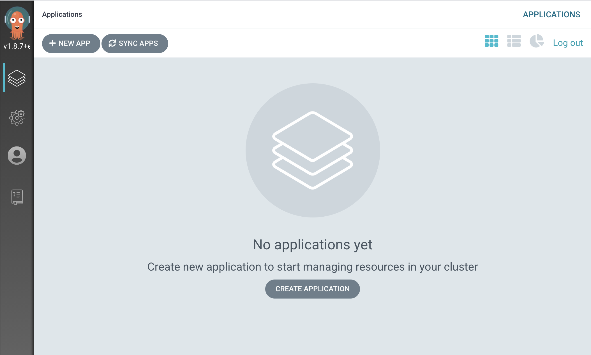
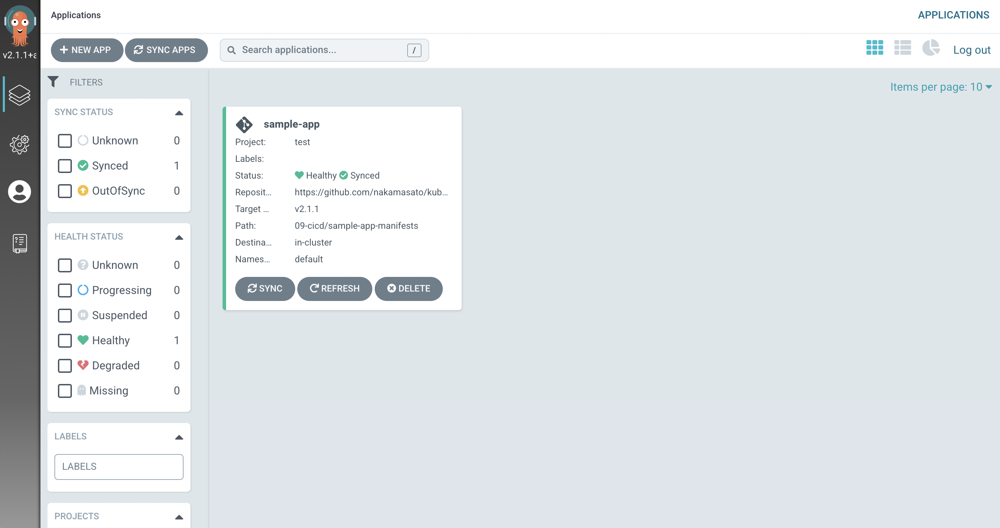
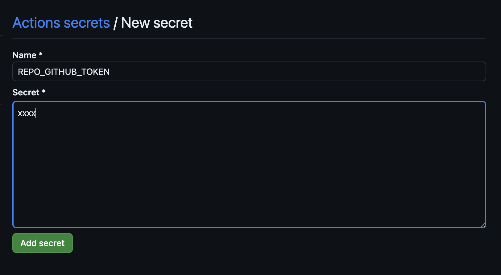

# CI/CD

## [ArgoCD](https://argo-cd.readthedocs.io/en/stable/)

## Setup

1. Install ArgoCD (Version [v2.8.4](https://github.com/argoproj/argo-cd/releases/tag/v2.8.4))

    ```
    kubectl create namespace argocd
    kubectl apply -n argocd -f https://raw.githubusercontent.com/argoproj/argo-cd/v2.8.4/manifests/install.yaml
    ```

1. Check
    ```
    kubectl get pod -n argocd
    NAME                                                READY   STATUS    RESTARTS   AGE
    argocd-application-controller-0                     1/1     Running   0          48s
    argocd-applicationset-controller-787bfd9669-xh6hh   1/1     Running   0          48s
    argocd-dex-server-bb76f899c-c92zj                   1/1     Running   0          48s
    argocd-notifications-controller-5557f7bb5b-mmpzv    1/1     Running   0          48s
    argocd-redis-b5d6bf5f5-zl6zm                        1/1     Running   0          48s
    argocd-repo-server-56998dcf9c-bz875                 1/1     Running   0          48s
    argocd-server-5985b6cf6f-44s47                      1/1     Running   0          48s
    ```

1. Expose port

    Either of the following methods:

    1. Create `Service` with `NodePort` type (port: 30080)

        ```
        kubectl apply -f argocd-server-node-port.yaml -n argocd
        ```

    1. Port forward the service (port: 30080)

        ```
        kubectl -n argocd port-forward service/argocd-server 30080:80
        ```

1. Login

    Open https://localhost:30080, click on `Advanced` and `Proceed to localhost (unsafe)` (this is ok because we're connecting to the argocd running in our local computer)

    - username: `admin`
    - password: `kubectl get secret argocd-initial-admin-secret -n argocd -o jsonpath='{.data.password}' | base64 --decode`

    

## Deploy an application using ArgoCD

1. Create `AppProject`
    ```
    kubectl apply -f argocd-appproject-test.yaml
    ```
1. Create `Application`

    ```
    kubectl apply -f argocd-application-sample-app.yaml
    ```

    <details>

    If you're updating manifests in https://github.com/nakamasato/fastapi-sample/tree/main/manifests/fastapi-sample

    ```yaml
     spec:
       project: test
       source:
    -    repoURL: https://github.com/nakamasato/kubernetes-basics.git # Forkしている場合はnakamasatoを自分のGithubアカウントに変更してく
    ださい
    -    targetRevision: v2.1.1
    -    path: 09-cicd/sample-app-manifests
    +    repoURL: https://github.com/nakamasato/fastapi-sample.git # Forkしている場合はnakamasatoを自分のGithubアカウントに変更してください
    +    path: manifests/fastapi-sample
    ```

    </details>

1. Deploy MySQL

    As you can see in [Run simple application in kubernetes](../06-run-simple-application-in-kubernetes), sample-app is dependent on mysql.
    So you need to run mysql in `default` namespace by

    ```
    kubectl apply -f mysql-manifests
    ```

    Exercise: Please create an ArgoCD application to sync MySQL.


## Check Appications on ArgoCD UI

1. Open https://localhost:30080/

    

1. Click on the `sample-app` application.

    

    You can see all the resources applied by ArgoCD are in healthy state.

## Create a GitHub Actions to update PR

1. Fork the sample-app and kubernetes-basics repos

    - https://github.com/nakamasato/fastapi-sample
    - https://github.com/nakamasato/kubernetes-basics

1. Generate a Personal Access Token (PAT) and configure it in the forked `fastapi-sample` repo.

    1. Open you GitHub Settings > Developer Settings > Personal Access Token

        Settings

        

        Developer settings

        

    1. Create Personal Access Token

        
    1. Set the personal access token in the secrets of `fastapi-sample` repo.

        Open https://github.com/<<your_github_name>>/fastapi-sample/settings/secrets/actions

        

    This is necessary to create a PR in the forked `kubernetes-basics` repo.

    For more details about Personal Access Token, please read [Personal Access Token](https://docs.github.com/authentication/keeping-your-account-and-data-secure/creating-a-personal-access-token)

1. Add `.github/workflows/deploy-pr.yml` on a new branch.

    Please replace `<yourgithubname>` with your github name.

    ```yaml
    name: deploy-pr

    on:
      pull_request:

    env:
      REGISTRY: ghcr.io
      IMAGE_NAME: ${{ github.repository }}

    jobs:
      # https://docs.github.com/ja/packages/managing-github-packages-using-github-actions-workflows/publishing-and-installing-a-package-with-github-actions#publishing-a-package-using-an-action
      build-and-push-image:
        runs-on: ubuntu-latest
        outputs: # https://docs.github.com/en/actions/learn-github-actions/workflow-syntax-for-github-actions#jobsjob_idoutputs
          tags: ${{ steps.meta.outputs.tags }}
        permissions:
          contents: read
          packages: write

        steps:
          - name: Checkout repository
            uses: actions/checkout@v2

          - name: Log in to the Container registry
            uses: docker/login-action@f054a8b539a109f9f41c372932f1ae047eff08c9
            with:
              registry: ${{ env.REGISTRY }}
              username: ${{ github.actor }}
              password: ${{ secrets.GITHUB_TOKEN }}

          - name: Extract metadata (tags, labels) for Docker
            id: meta
            uses: docker/metadata-action@98669ae865ea3cffbcbaa878cf57c20bbf1c6c38
            with:
              images: ${{ env.REGISTRY }}/${{ env.IMAGE_NAME }}

          - name: Build and push Docker image
            uses: docker/build-push-action@ad44023a93711e3deb337508980b4b5e9bcdc5dc
            with:
              context: app
              push: true
              tags: ${{ steps.meta.outputs.tags }}
              labels: ${{ steps.meta.outputs.labels }}
      update-manifest:
        needs: build-and-push-image
        runs-on: ubuntu-latest
        steps:
          - name: Checkout <yourgithubname>/kubernetes-basics #https://github.com/nakamasato/kubernetes-basics/blob/v2.0-rc/09-cicd/sample-app-manifests/deployment.yaml
            uses: actions/checkout@v2
            with:
              repository: <yourgithubname>/kubernetes-basics # レクチャーと同じように試したい場合には、 Forkして <your github account>/kubernetes-basics というふうに変更してください
              ref: v2.0-rc
          - name: Update manifest file
            env:
              YAML_PATH: 09-cicd/sample-app-manifests/deployment.yaml
              CONTAINER_NAME: fastapi-sample
              IMAGE_FULL_NAME: ${{ needs.build-and-push-image.outputs.tags }} # pull_request -> ghcr.io/nakamasato/fastapi-sample:pr-{pull-request-num}
            run: |
              yq e -i "(.spec.template.spec.containers[]|select(.name == \"${CONTAINER_NAME}\").image)|=\"${IMAGE_FULL_NAME}\"" ${YAML_PATH}
              cat ${YAML_PATH}
          - name: Create PR
            uses: peter-evans/create-pull-request@v3
            with:
              token: ${{ secrets.REPO_GITHUB_TOKEN }} # レクチャー内では、Personal Access Tokenを発行して fastapi-sampleレポから kubernetes-basicsレポコードをプッシュできる権限を与えました。
              title: "Update fastapi-sample"
              base: v2.0-rc
              draft: true
              body: |
                # Changes
                - Update `fastapi-sample` image
    ```

    1. About outputs in job: https://docs.github.com/en/actions/using-workflows/workflow-syntax-for-github-actions#jobsjob_idoutputs
    1. GitHub Actions to create a PR: https://github.com/peter-evans/create-pull-request

1. Push the commit that includes the `.github/workflows/deploy-pr.yaml` and create a pr.

    1. Example PR: https://github.com/nakamasato/fastapi-sample/pull/55
    1. [PR](https://github.com/nakamasato/fastapi-sample/pull/55) will trigger GitHub Actions job to create a PR in kubernetes-basics repo: https://github.com/nakamasato/kubernetes-basics/pull/17

1. Merge the created PR in kubernetes-basics repo and ArgoCD will apply the change.

## Clean up

1. Delete MySQL

    ```
    kubectl delete -f mysql-manifests
    ```

1. Delete ArgoCD `Application` and `AppProject`.

    ```
    kubectl delete -f argocd-application-sample-app.yaml
    kubectl delete -f argocd-appproject-test.yaml
    ```

1. Uninstall ArgoCD and delete the `argocd` namespace.

    ```
    kubectl delete -n argocd -f https://raw.githubusercontent.com/argoproj/argo-cd/v2.1.1/manifests/install.yaml
    kubectl delete ns argocd
    ```
